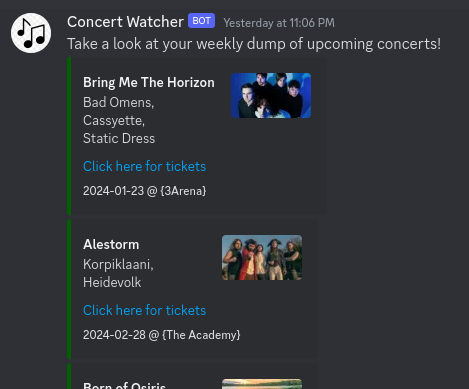

Concert-Watcher
===
<a href="https://hub.docker.com/repository/docker/ryanconnell/concert-watch/tags?page=1&ordering=last_updated"></a>


Searching through the ticketmaster website manually is an absolute pain. Instead of that this script will query the ticketmaster API for a list of nearby concerts and then compare the artists with a list of artists _you_ want to be notified about.

Notifications can then be sent via Discord to keep you updated on any new concerts that you might be interested in.



## Getting Start
Theres a few things you'll need to set up before running this script.

### 1. Ticketmaster API Token
You'll need to create a new Ticketmaster API token on [developer.ticketmaster.com](https://developer.ticketmaster.com)

### 2. Artists file
A file containing a list of artists (1 per line) that you want to be notified about will need to created and passed to the application via the `--artistFile` flag.

An example artist file might look something like the following:
```
Bad Omens
Bleed From Within
Bring Me The Horizon
Bury Tomorrow
```

In the future I would like to provide support for scraping Youtube Music and/or Spotify for a list of artists but as of right now this needs to be manually populated. (Some copy/pasting and a few sed commands will likely do the trick here to quickly get this generated)

### 3. Customise the Ticketmaster Search Criteria
Ticketmaster covers a _lot_ of events and regions so to help reduce the search space we can make use of a YAML file that provides extra query parameters to our API calls. 

An example YAML file can be found in [./helm/files/ticketmaster.yaml](https://github.com/RyanConnell/concert-watch/blob/main/helm/files/ticketmaster.yaml). As an example, the following criteria will filter our results to show concerts taking place anywhere in Ireland:
```yaml
# Filter results to Ireland.
countryCode: IE

# Filter results to concerts.
classificationName: music
```

Check out https://developer.ticketmaster.com/products-and-docs/apis/discovery-api/v2/#search-events-v2 for a full list of supported filters.

### 4. (Optional) Discord Notifications
The current notification mechanism is via Discord Webhooks. Check out the official discord support page for information on how to create a webhook for your discord server: https://support.discord.com/hc/en-us/articles/228383668-Intro-to-Webhooks

## Running the application

### Docker
Assuming that you have placed your ticketmaster YAML and your artists file in a folder called `/path/to/config` we can run the following:
```
docker run --rm -it \
   -v /path/to/config:/config:Z \
   -e TICKETMASTER_API_KEY=ticketmaster_api_key_goes_here \
   -e DISCORD_WEBHOOK_URL=discord_webhook_url_goes_here \
   ryanconnell/concert-watch:latest \
   sh -c '/bin/concert-watch --apiKey=$TICKETMASTER_API_KEY --artistFile=/config/artists --ticketmasterConfig=/config/ticketmaster.yaml --discordWebhookURL=$DISCORD_WEBHOOK_URL'
```
Don't forget to replace the `ticketmaster_api_key_goes_here` and `discord_webhook_url_goes_here` with the values you generated in the above sections.
